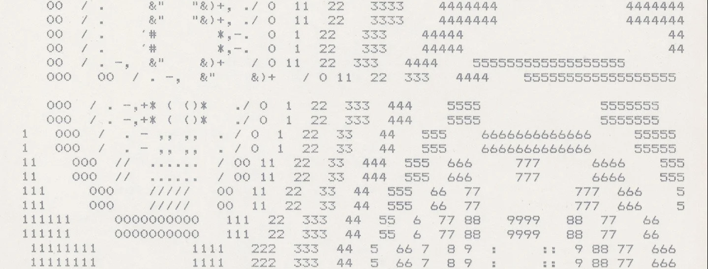
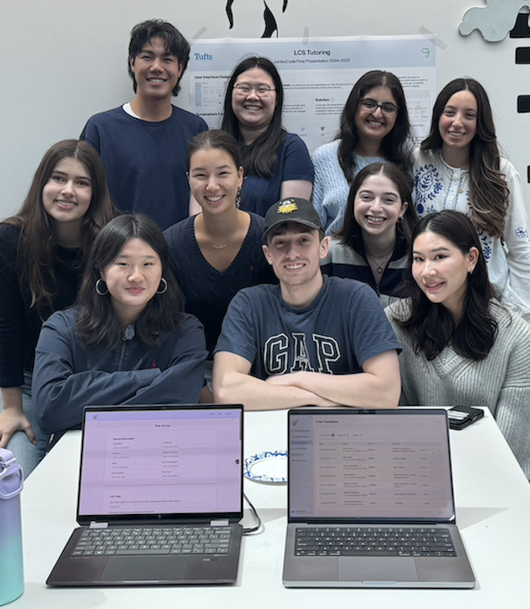

<!---->

  

<table >
<tr>

<td>

## 🌟 About Me

I'm **Caitlyn**, a junior at Tufts university studying **Computer Science and Data Science** with a deep interest in **Ethical AI**. I'm dedicated to exploring how technology can be developed and deployed responsibly to create positive impact while addressing bias, fairness, and transparency in artificial intelligence systems.

I love working at the intersection of technology and social responsibility, building solutions that not only solve technical problems but also consider their broader implications on society.

</td>

<td width="325">
  
</td>
</tr>
</table>

## 📫 Let's Connect!
  
📧 caitlyn.wei@tufts.edu

  
🔗 [linkedin.com/in/caitlynwei](https://linkedin.com/in/caitlynwei)

  <a href="https://caitlynwei.xyz">
    

  </a>
    <a href="https://caitlynwei.xyz">
    Check out my website!
  </a>

  

---

## 🛠️ My Tech Stack

### **Programming Languages**

### **ML/DL**

### **Misc**

---

## 🚀 Featured Project: 🎓 Leonard Carmichael Society Tutoring Website
**Description:** The Leonard Carmichael Society (LCS) is a Tufts-affiliated nonprofit offering free K–12 tutoring to Medford/Somerville students.

**Problem Solved:**  We collaborated closely with LCS to **_address pain points in tutor/tutee management and communication_** leading to the development of a scalable full-stack web platform using **React**, **TypeScript**, **Tailwind CSS**, **Node.js**, **Express.js**, **PostgreSQL**, and **DrizzleORM**, featuring:

- 🧑‍💻 Role-based login systems with **separate UI/UX flows for tutors, tutees, and administrators**

- 📊 An automated, **optimized pairing system** inspired by Gale-Shapley and PCA, replacing manual spreadsheet matching

- 📬 **Integrated email workflows** for real-time updates and scheduling

- 📌 A professional, user-friendly interface that **strengthened LCS’s brand and outreach**

🔗 **Links:** [Repository](https://github.com/JumboCode/lcs-tutoring) [Live Demo](https://lcstutoring.vercel.app/)

## 🌟 Projects
### **🏠 NYC Airbnb Price Prediction**

**Description:** An end-to-end ML production for several price prediction models.

**Problem Solved:**  The goal of this project was to predict the price of an Airbnb listing accurately while also identifying whether a listing is priced higher or lower than average. To achieve this, I implemented a full ML pipeline using **Python**, **Pandas**, **Scikit-learn**, and **Seaborn** with the following key features:

- 🧼 Clean and prepare NYC Airbnb listing dataset

- 📈 Linear Regression and SGD Regressor models to predict continuous numerical price label

- 👯‍♀️ Logisitic Regression and Decision Tree models to predict whether a listing is above or below the mean listing price

- 🧮 Model performance analysis and comparison

🔗 **Links:** [Repository](https://github.com/caitlynwei/airbnb-price-prediction-regression-and-classification)

### **🌎 Global Carbon Emissions Timeseries Forecast Model**
**Description:** Multiple an end to end ML production for multiple timeseries models ((S)ARIMA(X)) that predict carbon emissons
**Problem Solved:**  The goal of this project was to predict the price of an Airbnb listing accurately while also identifying whether a listing is priced higher or lower than average. To achieve this, I implemented a full ML pipeline using **Python**, **Pandas**, **Scikit-learn**, and **Seaborn** with the following key features:

- 🗂️ Clean and transformed data in [Global Carbon Project Emissions dataset](https://zenodo.org/records/14106218) to increase stationarity

- 🔨 Decomposed training data into components (Seasonal/Long Term) using ACF PACF graph analysis

- 📊 Tuned hyperparameters for (S)ARIMA(X) timeseries models using ACF and PACF graph analysis

- ✅ Evaluated model performance through AIC and BIC

🔗 **Links:** [Repository](https://github.com/caitlynwei/airbnb-price-prediction-regression-and-classification)](https://github.com/bttai-c02-emissions-2025/co2-forecast-model)

---

  
**"The only way humans have ever figured out of getting somewhere is to leave something behind"**

