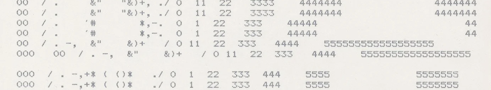

<!---->

  

<table >
<tr>

<td>

## 🌟 About Me

I'm **Caitlyn**, a junior at Tufts university studying **Computer Science and Data Science** with a deep interest in **Ethical AI**. I'm dedicated to exploring how technology can be developed and deployed responsibly to create positive impact while addressing bias, fairness, and transparency in artificial intelligence systems.

I love working at the intersection of technology and social responsibility, building solutions that not only solve technical problems but also consider their broader implications on society.

</td>

<td width="325">
  
</td>
</tr>
</table>

## 📫 Let's Connect!
 
: <a href="mailto:caitlyn.wei@tufts.edu">caitlyn.wei@tufts.edu</a>

: 
www.linkedin.com/in/caitlynwei/

Check out my [personal website!](https://caitlynwei.xyz/)

---

## 🛠️ My Tech Stack

### **Programming Languages**

### **ML/DL**

### **Misc**

---

## 🚀 Featured Project: 🎓 Leonard Carmichael Society Tutoring Website
**Description:** The Leonard Carmichael Society (LCS) is a Tufts-affiliated nonprofit offering free K–12 tutoring to Medford/Somerville students.

**Problem Solved:**  We collaborated closely with LCS to **_address pain points in tutor/tutee management and communication_** leading to the development of a scalable full-stack web platform using **React**, **TypeScript**, **Tailwind CSS**, **Node.js**, **Express.js**, **PostgreSQL**, and **DrizzleORM**, featuring:

- 🧑‍💻 Role-based login systems with **separate UI/UX flows for tutors, tutees, and administrators**

- 📊 An automated, **optimized pairing system** inspired by Gale-Shapley and PCA, replacing manual spreadsheet matching

- 📬 **Integrated email workflows** for real-time updates and scheduling

- 📌 A professional, user-friendly interface that **strengthened LCS’s brand and outreach**

🔗 **Links:** [Repository](https://github.com/JumboCode/lcs-tutoring) [Live Demo](https://lcstutoring.vercel.app/)

### 👀 Coming Soon - Fall Break Through Tech AI Studio Project

---

  
**"The only way humans have ever figured out of getting somewhere is to leave something behind"**

